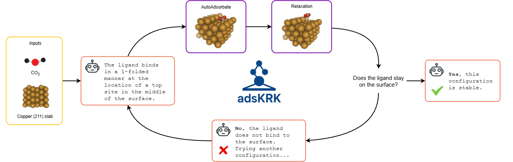

<!--  -->
<p style="text-align: center;">
  
</p>

<br>


[](https://github.com/schwallergroup/liac-repo)
[](https://schwallergroup.github.io)


<h1 align="left">
  AdsKRK: An agentic atomistic simulation framework for surface science.
</h1>


<br>

Welcome to the AdsKRK repository! This project is a prototype developed during the 2-day [LLM Hackathon for Application in Chemistry and Materials Science](https://llmhackathon.github.io/). 

The goal of AdsKRK is to showcase how Large Language Models (LLMs) can autonomously explore the binding configurations of small ligands on hetero-catalytic surfaces. Starting from only a SMILES string and a surface structure (XYZ format), the agent can:
* generate binding configurations,
* run structure relaxations,
* analyze the results, and
* iterate until a stable configuration is found.

Users can also interact with the agent - asking questions about the system or guiding the search process by introducing biases through prompts.

At the core of AdsKRK is [AutoAdsorbate](https://github.com/basf/autoadsorbate) - a powerful tool for generating chemically meaningful molecular and fragment configurations on surfaces, providing a search space for the agent.

One particularly interesting finding during the hackathon was the agent’s ability to reason about molecular dynamics (MD) and relaxation trajectories. For example, in our demo case of CO₂ on a copper surface, the LLM can compare conformations before and after relaxation, and give its analysis accordingly:

```
The stability of the initial adsorption configuration was assessed by performing a structural relaxation. Based on the output from the simulation, the fragment did not remain bound to the surface.
...
Therefore, to answer the user's question: no, the fragment does not stay covalently bound. The initial configuration, with the carbon atom placed on a top site of the Cu(211) surface, is unstable and leads to the desorption of the ligand.
``` 

Which is quite impressive and might pique interest for future research about LLM reasoning for MD trajectory!

## 👩‍💻 Installation
```bash
$ git clone https://github.com/schwallergroup/llm_adsorbate.git
$ cd llm_adsorbate
$ uv pip install -e .
```

## 🔥 Usage
This project is used via its Streamlit interface.
```shell
streamlit run src/app/app.py
```

Then, provide the required inputs ( SMILES, XYZ file, and your query) in the sidebar and click "Run Agent".
