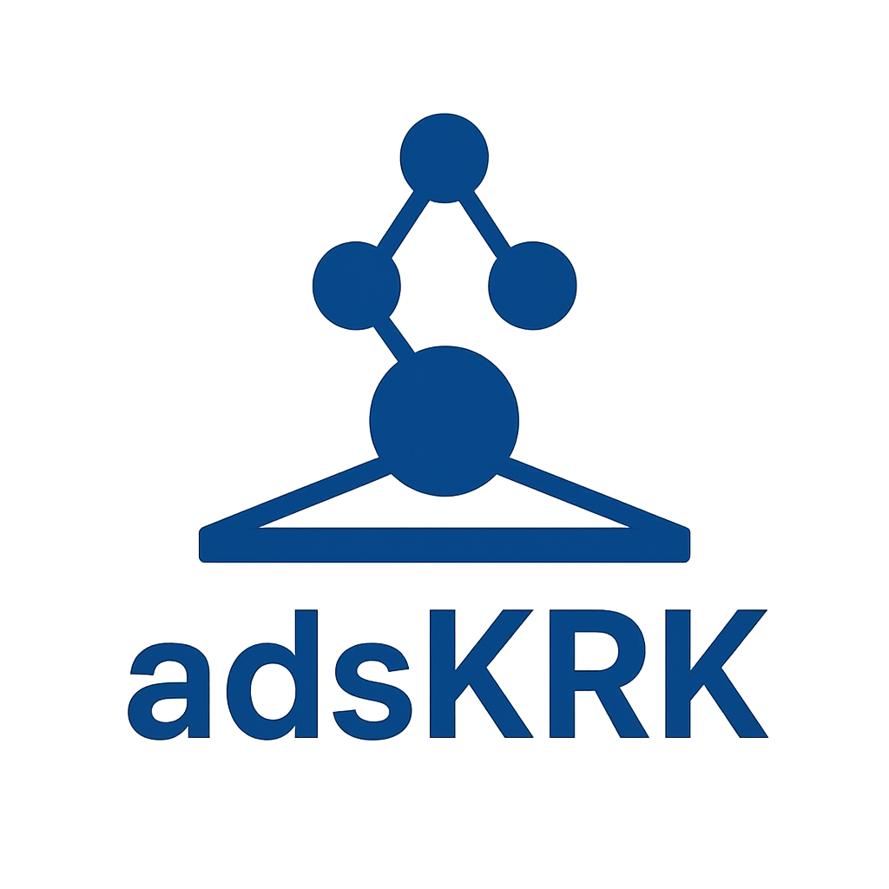

<br>


[](https://github.com/schwallergroup/liac-repo)
[](https://schwallergroup.github.io)


<h1 align="center">
  adsKRK
</h1>


<br>

LLM hackathon - An LLM agent system for the autonomous exploration of stable absorbate structures on catalytic surfaces.

## 👩‍💻 Installation
```bash
$ git clone https://github.com/schwallergroup/llm_adsorbate.git
$ cd llm_adsorbate
$ uv pip install -e .
```

## 🔥 Usage
This project is used via its Streamlit interface.
```shell
streamlit run src/app/app.py
```

Then, provide the required inputs ( SMILES, XYZ file, and your query) in the sidebar nad click "Run Agent".
